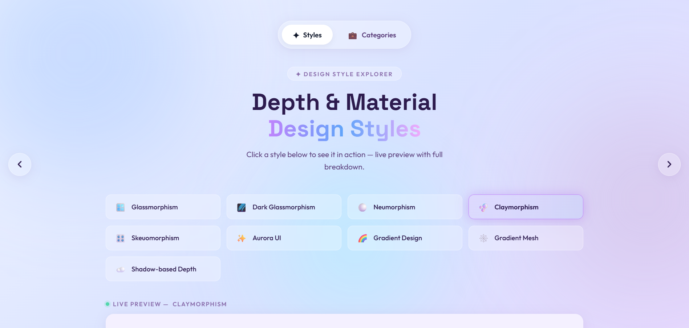
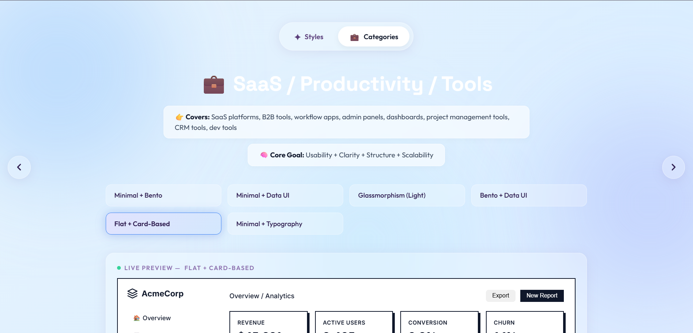

# DESIGN STYLE EXPLORER

## Overview

DESIGN STYLE EXPLORER is a design decision system built for frontend developers, indie builders, and AI-assisted “vibe coders” who want their interfaces to feel intentional, polished, and product-level instead of generic AI-generated UI.

The project was created to solve a common problem in modern frontend development workflows: developers can generate interfaces quickly using AI tools, but often struggle to choose the right visual direction, interaction style, and design language for a specific product category.

Rather than functioning as a simple gallery of screenshots, this platform is designed as a structured exploration and decision framework that helps users understand:

- which design styles exist,
- when they should be used,
- when they should be avoided,
- and how different styles translate into real-world product interfaces.

---
## Screenshots

### Style Explorer

### Finance Category

# Purpose

The primary purpose of this project is to bridge the gap between:

- fast AI-assisted frontend generation,
- and thoughtful product-level visual design.

Many developers can generate layouts rapidly, but lack:

- design vocabulary,
- style direction,
- UI decision-making frameworks,
- and category-specific visual understanding.

DESIGN STYLE EXPLORER provides:

- curated design systems,
- live visual previews,
- category-specific UI structures,
- design combinations,
- implementation prompts,
- and practical usage guidance.

The platform aims to help developers make better visual decisions before writing or generating frontend code.

---

# What the Website Consists Of

The platform is divided into two major exploration systems.

## 1. Style Explorer
The Style Explorer focuses on individual design languages and visual systems.

### Examples Include

- Minimalism
- Bento Grid
- Glassmorphism
- Brutalism
- Editorial
- Cyberpunk
- Motion UI
- Organic Design
- Data-Driven UI
- Spatial UI

### Each Style Category Includes

- interactive style buttons,
- live preview rendering,
- design explanations,
- usage guidance,
- visual direction,
- implementation notes,
- and prompt references.

The previews dynamically change styling while preserving a shared structural system, allowing users to compare design philosophies clearly.

---

## 2. Category Explorer

The Category Explorer focuses on real-world product categories and their most effective design combinations.

### Examples Include

- SaaS / Productivity
- Finance / Analytics
- AI / Startup
- Portfolio / Creator
- Marketing / Landing Pages
- Creative / Media / Entertainment

### Each Category Contains

- curated design combinations,
- product-level UI previews,
- category-specific layouts,
- visual hierarchy systems,
- design decision documentation,
- anti-pattern warnings,
- and quick decision tables.

The goal is to simulate how modern production-grade interfaces are actually designed across different industries.

---

# Architecture and Implementation

The project is built around a shared application shell with dynamic rendering logic.

The system uses:

- a shared navigation and transition framework,
- JavaScript-driven rendering,
- dynamic `innerHTML` injection,
- modular CSS systems,
- category-specific visual structures,
- and reusable preview architecture.

Each category has:

- its own internal composition,
- visual direction,
- and layout rhythm,

while maintaining:

- consistent interaction behavior,
- navigation structure,
- responsiveness,
- and transition logic.

This allows the platform to scale without duplicating entire application pages.

---

# Design Philosophy

The project intentionally avoids:

- generic template galleries,
- static inspiration boards,
- and purely aesthetic showcases.

Instead, it focuses on:

- design reasoning,
- practical UI decision-making,
- product realism,
- and contextual usage.

The emphasis is not only on how a design looks, but:

- why it works,
- where it works,
- and where it fails.

---

# Current Features

- Interactive Style Explorer
- Interactive Category Explorer
- Dynamic preview rendering
- Product-level UI simulations
- Category-specific visual systems
- Design combination guidance
- Usage and anti-pattern documentation
- Quick decision frameworks
- Responsive navigation system
- Shared rendering architecture

---

# Future Plans

Planned improvements include:

- searchable design recommendations,
- design filtering by product goals,
- AI-assisted combination suggestions,
- exportable prompts,
- community-contributed patterns,
- and expanded category systems.

---

# Tech Stack

- HTML
- CSS
- JavaScript

The project currently focuses on frontend interaction systems, visual architecture, and scalable UI rendering patterns.

---

# Why This Project Exists

DESIGN STYLE EXPLORER was built to help developers move beyond:

> “generate and ship” UI workflows

toward:

- intentional,
- design-aware,
- product-level frontend creation.

The goal is to make strong visual decision-making faster, more accessible, and easier to explore for modern frontend builders.